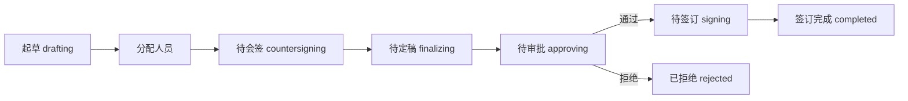

# 合同管理系统前端

企业内部合同全生命周期管理前端演示项目。当前版本为纯前端实现，采用 React 18、TypeScript、Vite、TailwindCSS、React Router v6、Zustand、React Hook Form、Zod 和 Mock 数据实现。

## 当前状态

- 前端代码位于 `frontend/`。
- `backend/` 当前仅保留目录占位，暂无可运行后端服务。
- 数据来自 `frontend/src/mock`，并通过 Zustand persist 存在浏览器本地存储中。
- 旧版原生 JS 入口已删除，当前入口为 `frontend/index.html` 加载 `/src/main.tsx`。

## 完整运行流程

Windows PowerShell 建议使用 `npm.cmd`，避免系统脚本策略拦截 `npm.ps1`。

```bash
cd frontend
npm.cmd install
npm.cmd run dev
```

启动成功后访问：

```text
http://127.0.0.1:5173/
```

如果终端显示的是 `http://localhost:5173/`，也可以直接访问该地址。

## 构建和预览

构建检查：

```bash
cd frontend
npm.cmd run build
```

本地预览构建产物：

```bash
cd frontend
npm.cmd run preview
```

默认预览地址通常为：

```text
http://127.0.0.1:4173/
```

## 测试账号

- 管理员：`admin / admin123`
- 合同操作员：`operator / operator123`
- 新用户示例：`newuser / newuser123`

注册产生的新账号默认只有 `new_user` 角色，需要管理员在“权限分配”中授权。

## 角色可见菜单

- 管理员：工作台、查询统计、基础数据、分配合同、用户管理、角色管理、权限分配、日志管理。
- 合同操作员：工作台、起草合同、待会签合同、待定稿合同、待审批合同、待签订合同、查询统计、基础数据。
- 新用户：登录后仅显示等待授权提示，需管理员分配角色。

## 合同状态流转



## 目录

- `frontend/index.html`：Vite HTML 入口，挂载 `#root` 并加载 `/src/main.tsx`。
- `frontend/src/main.tsx`：React 入口、路由配置、权限路由守卫。
- `frontend/src/index.css`：Tailwind 入口和全局样式。
- `frontend/src/pages`：页面路由。
- `frontend/src/components`：表格、表单、弹窗、状态标签等公共组件。
- `frontend/src/store`：Zustand 状态与流程动作。
- `frontend/src/mock`：初始化 Mock 数据。
- `frontend/src/types`：业务类型。
- `frontend/src/utils`：日期、状态、流程工具。
- `docs/`：需求、前端开发说明、前后端通信说明。
- `backend/`：后端目录占位，后续接入真实后端时使用。

## 交接注意事项

- 不需要运行 `frontend/server.js`，该旧静态服务器已删除。
- 不需要引用 `frontend/styles.css` 或 `frontend/js/main.js`，当前样式由 `src/index.css` 和 Tailwind 生成。
- `node_modules/`、`dist/`、`.idea/`、日志文件不会提交到 Git。
- 如果接入真实后端，请参考 `docs/前后端通信文档.md`，不要在前端代码中硬编码密钥、数据库连接串或 Token。
