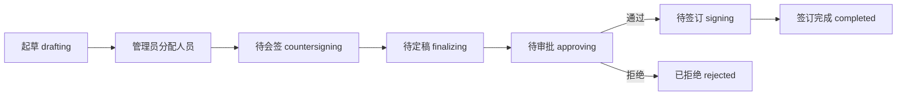

## 1. 项目概述
本项目是合同管理系统的前端 Web 应用，采用 B/S 架构，当前版本为纯前端实现，使用 Mock 数据和 Zustand 持久化模拟后端能力。

系统覆盖合同全生命周期：

```latex
起草 -> 分配 -> 会签 -> 定稿 -> 审批 -> 签订
```

支持三类用户：

+ 管理员：分配合同流转人员，维护用户、角色、权限，查看日志。
+ 合同操作员：起草、会签、定稿、审批、签订合同。
+ 新用户：注册后等待管理员授权。

## 2. 技术栈
前端目录位于 `frontend/`。

| 类型 | 技术 |
| --- | --- |
| 框架 | React 18 + TypeScript + Vite |
| 样式 | TailwindCSS |
| 路由 | React Router v6 |
| 状态 | Zustand + persist |
| 表单 | React Hook Form + Zod |
| 图标 | lucide-react |
| 日期 | dayjs |
| 数据 | `src/mock` 静态数据 |


未使用 Ant Design、Element Plus 等默认 UI 主题。

## 3. 运行方式
PowerShell 环境建议使用 `npm.cmd`，避免系统脚本策略拦截 `npm.ps1`。

首次拉取项目后安装依赖：

```bash
cd frontend
npm.cmd install
```

启动开发环境：

```bash
cd frontend
npm.cmd run dev
```

默认访问：

```latex
http://127.0.0.1:5173
```

当前项目入口为 `frontend/index.html`，页面挂载点为 `#root`，脚本入口为 `/src/main.tsx`。

生产构建：

```bash
cd frontend
npm.cmd run build
```

本地预览构建产物：

```bash
cd frontend
npm.cmd run preview
```

预览地址通常为：

```latex
http://127.0.0.1:4173
```

当前版本为纯前端 Mock 演示，`backend/` 仅保留目录占位，暂无后端服务需要启动。

## 4. 测试账号
```latex
管理员：admin / admin123
合同操作员：operator / operator123
新用户：newuser / newuser123
```

注册产生的新账号默认拥有 `new_user` 角色，需要管理员在“权限分配”中授权。

## 5. 目录结构
```latex
frontend/
  index.html
  package.json
  vite.config.ts
  tailwind.config.ts
  postcss.config.js
  tsconfig.json
  src/
    main.tsx
    index.css
    components/
    layouts/
    mock/
    pages/
    store/
    types/
    utils/
backend/
  .gitkeep
```

核心目录说明：

+ `frontend/index.html`：Vite HTML 入口，挂载 `#root` 并加载 `/src/main.tsx`。
+ `src/main.tsx`：应用入口、路由配置、权限路由守卫。
+ `src/index.css`：全局样式、表格、滚动条、基础字号。
+ `src/layouts/AppLayout.tsx`：登录后的顶部栏、侧边栏、主内容布局。
+ `src/components`：按钮、表单、弹窗、表格、分页、状态标签、流程步骤等公共组件。
+ `src/pages`：按业务模块组织页面。
+ `src/store/appStore.ts`：业务状态、登录注册、合同流程动作、增删改查动作。
+ `src/store/uiStore.ts`：Toast 和确认弹窗状态。
+ `src/mock/data.ts`：初始化用户、角色、权限、客户、合同、流程、日志。
+ `src/types/index.ts`：业务数据类型。
+ `src/utils`：日期格式化、状态文案、流程判断工具。
+ `backend/`：后端目录占位，后续接入真实后端时使用。

已删除旧版原生 JS 入口，不再使用 `frontend/server.js`、`frontend/styles.css`、`frontend/app.js`、`frontend/js/main.js`。

## 6. 页面与路由
| 路由 | 页面 |
| --- | --- |
| `/login` | 登录 |
| `/register` | 注册 |
| `/dashboard` | 工作台 |
| `/contract/draft` | 起草合同 |
| `/contract/countersign` | 待会签合同 |
| `/contract/finalize` | 待定稿合同 |
| `/contract/approve` | 待审批合同 |
| `/contract/sign` | 待签订合同 |
| `/query/info` | 合同信息查询 |
| `/query/process` | 合同流程查询 |
| `/base/contract` | 合同信息管理 |
| `/base/customer` | 客户信息管理 |
| `/system/assign` | 分配合同 |
| `/system/user` | 用户管理 |
| `/system/role` | 角色管理 |
| `/system/permission` | 权限分配 |
| `/system/log` | 日志管理 |
| `/403` | 无权限页面 |


未登录访问业务路由会跳转 `/login`。非管理员访问 `/system/*` 对应权限不足时跳转 `/403`。

## 7. 权限模型
权限定义在 `src/types/index.ts` 的 `PermissionKey`，权限分组定义在 `src/mock/data.ts` 的 `permissionGroups`。

内置角色：

+ `admin`：拥有全部权限。
+ `operator`：拥有合同操作、查询统计、基础数据权限。
+ `new_user`：无业务权限。
+ `finance`：拥有审批、签订和查询相关权限。

菜单显示由 `AppLayout.tsx` 根据当前用户角色权限过滤。

## 8. 合同流程
合同状态：

```latex
drafting        起草
countersigning  待会签
finalizing      待定稿
approving       待审批
signing         待签订
completed       签订完成
rejected        已拒绝
```

状态流转：



主要动作位于 `src/store/appStore.ts`：

+ `draftContract`：创建合同，状态为 `drafting`。
+ `assignContract`：生成会签、审批、签订流程记录，状态变为 `countersigning`。
+ `submitProcess`：提交会签或审批意见。
+ `submitFinalize`：定稿后进入审批。
+ `submitSign`：录入签订信息，完成后状态变为 `completed`。

## 9. Mock 数据
初始化数据位于 `src/mock/data.ts`：

+ 8 个用户。
+ 4 个角色。
+ 5 个客户。
+ 15 份合同，覆盖各流程状态。
+ 多条合同流程记录。
+ 30 条日志。

Zustand persist 使用本地存储键：

```latex
contract-management-system
```

点击“退出”会清除持久化数据并恢复初始化状态。

## 10. UI 规范落地
Tailwind 色板配置在 `frontend/tailwind.config.ts`。

主要约束：

+ 主色：`#1E3A5F`
+ 辅色：`#2C4A6E`
+ 背景：`#FFFFFF`
+ 分区：`#F7F8FA`
+ 描边：`#E5E7EB`
+ 正文：`#1F2937`
+ 次文：`#6B7280`
+ 弱文：`#9CA3AF`
+ 状态色：成功、警示、错误、进行中按需求色板使用。

字号要求：

+ 页面标题 24px。
+ 区块标题 18px。
+ 正文和表格 15px 起。
+ 输入框 16px。
+ 不使用 12px 字号。

组件规则：

+ 按钮圆角 6px。
+ 卡片圆角 8px。
+ 输入框圆角 6px。
+ Tag 圆角 4px。
+ 表格行高 56px。
+ 主内容区左右留白 32px。

## 11. 表单与交互
表单校验：

+ 登录、注册、用户、客户、合同表单使用 React Hook Form + Zod。
+ 校验模式为 `onBlur`。
+ 错误文案显示在输入框下方。

反馈：

+ 提交按钮点击后进入 loading 状态，模拟 600-800ms 延迟。
+ 成功和错误提示使用顶部 Toast。
+ 删除操作使用确认弹窗。
+ 空表格使用线性文件夹 SVG 空状态。
+ 日志支持 CSV 导出。

